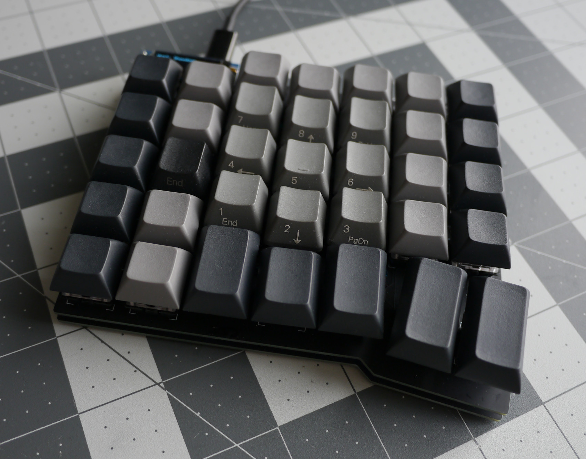
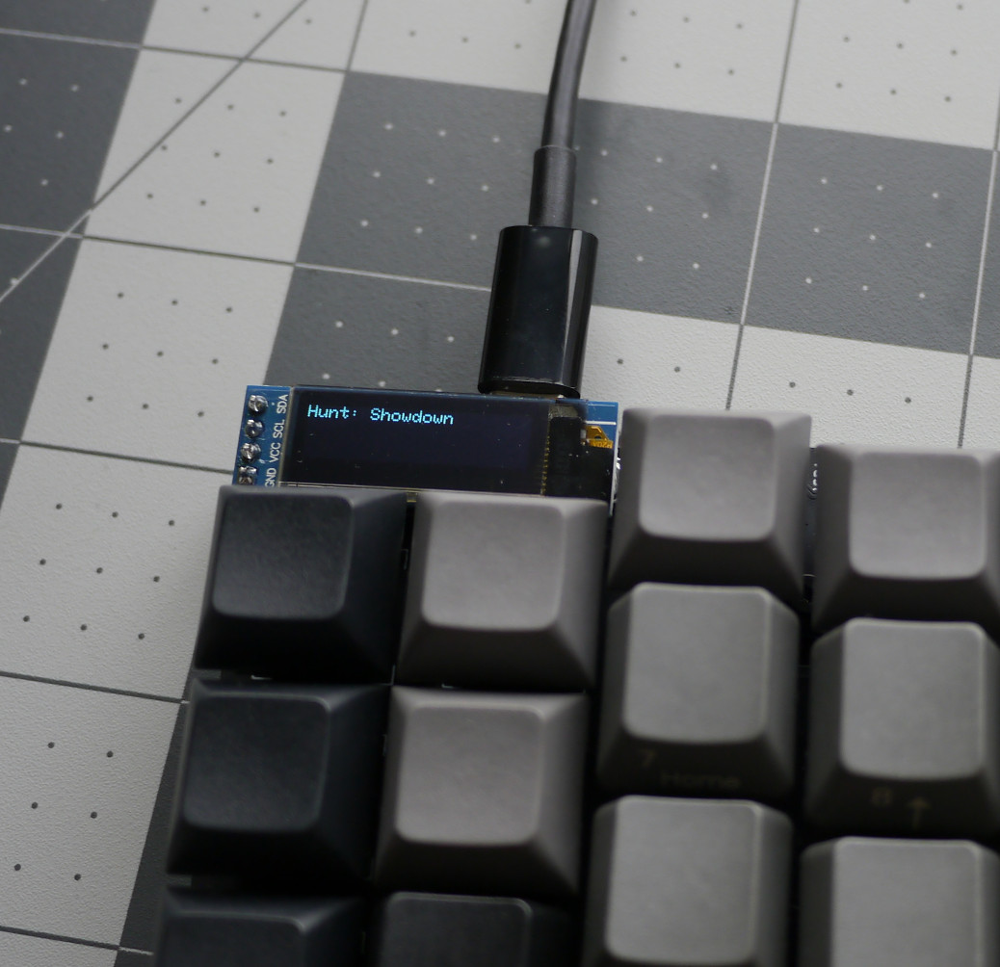
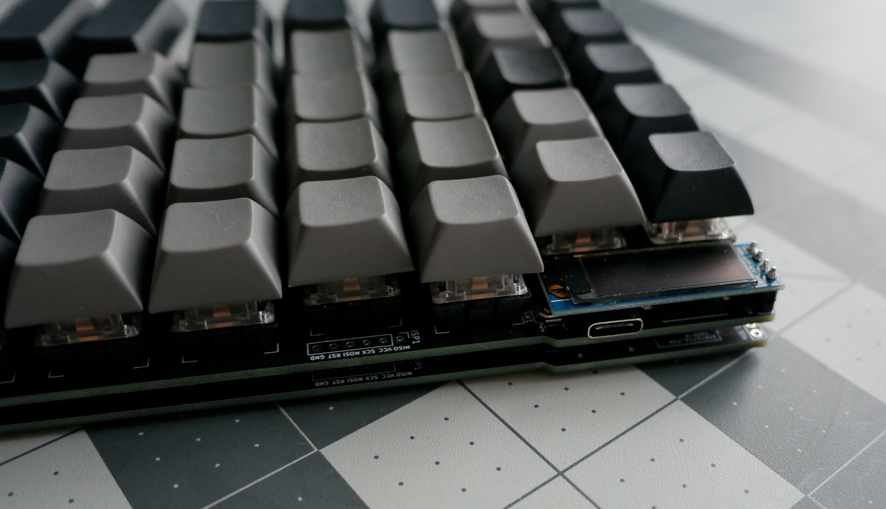
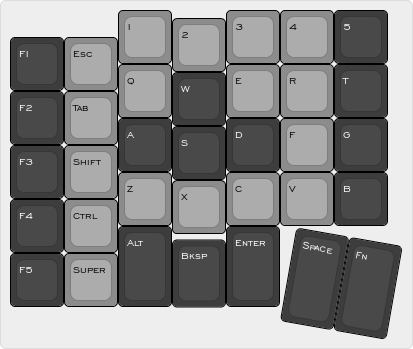

# MechLlama G35
A 35 key left-handed columnar layout macropad.

## Images

## Default Layout

[Keyboard Layout Editor](http://www.keyboard-layout-editor.com/##@@_x:2&c=%238c8c8c&p=DSA%3B&=1&_x:1%3B&=3&=4&_c=%233d3d3d&t=%23ffffff%3B&=5%3B&@_y:-0.85&x:3&c=%238c8c8c&t=%23000000%3B&=2%3B&@_y:-0.65&c=%233d3d3d&t=%23ffffff%3B&=F1&_c=%238c8c8c&t=%23000000%3B&=Esc%3B&@_y:-0.5&x:2%3B&=Q&_x:1%3B&=E&=R&_c=%233d3d3d&t=%23ffffff%3B&=T%3B&@_y:-0.8500000000000001&x:3%3B&=W%3B&@_y:-0.6499999999999999%3B&=F2&_c=%238c8c8c&t=%23000000%3B&=Tab%3B&@_y:-0.5&x:2&c=%233d3d3d&t=%23ffffff%3B&=A&_x:1%3B&=D&_c=%238c8c8c&t=%23000000%3B&=F&_c=%233d3d3d&t=%23ffffff%3B&=G%3B&@_y:-0.8500000000000001&x:3%3B&=S%3B&@_y:-0.6499999999999999%3B&=F3&_c=%238c8c8c&t=%23000000%3B&=Shift%3B&@_y:-0.5&x:2%3B&=Z&_x:1%3B&=C&=V&_c=%233d3d3d&t=%23ffffff%3B&=B%3B&@_y:-0.8500000000000001&x:3&c=%238c8c8c&t=%23000000%3B&=X%3B&@_y:-0.6499999999999999&c=%233d3d3d&t=%23ffffff%3B&=F4&_c=%238c8c8c&t=%23000000%3B&=Ctrl%3B&@_y:-0.5&x:2&c=%233d3d3d&t=%23ffffff&h:1.5%3B&=Alt&_x:1&h:1.5%3B&=Enter%3B&@_y:-0.75&x:3&h:1.25%3B&=Bksp%3B&@_y:-0.75%3B&=F5&_c=%238c8c8c&t=%23000000%3B&=Super%3B&@_r:10&rx:5&ry:5.75&y:-1.75&c=%233d3d3d&t=%23ffffff&h:1.75%3B&=Space&_h:1.75%3B&=Fn)

